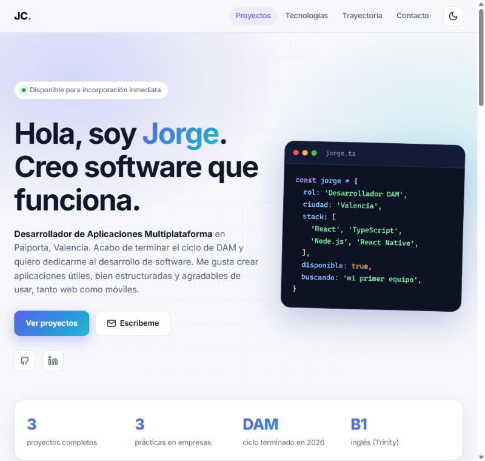
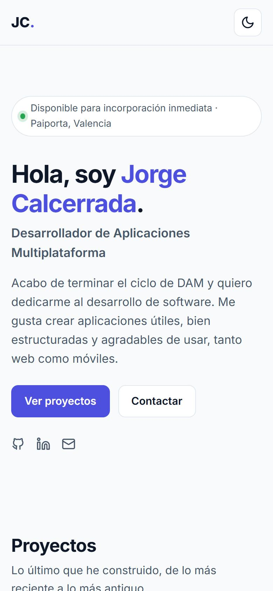
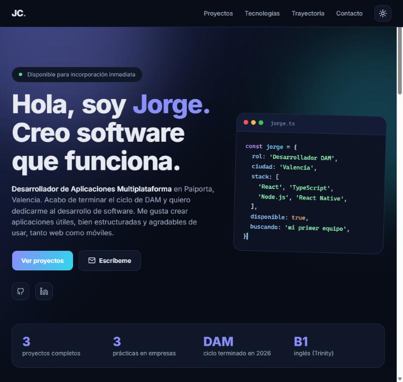
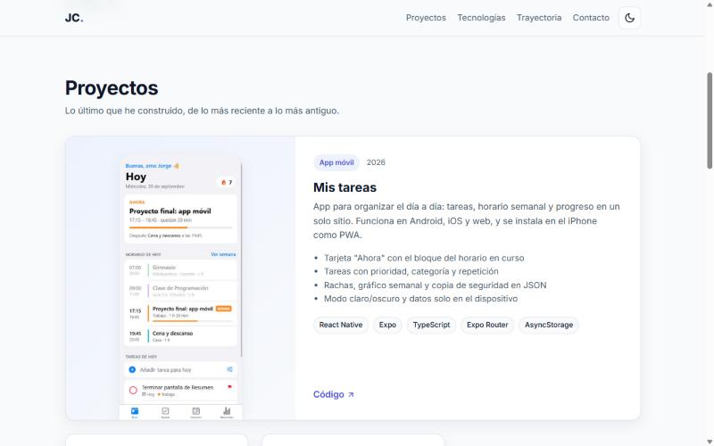

# Portfolio · Jorge Calcerrada 👨‍💻

Mi web personal: quién soy, qué proyectos he hecho y cómo contactarme.
Es una página de una sola vista, **responsive** y con **modo oscuro**, hecha con **React + TypeScript + Vite**
y publicada gratis en GitHub Pages.

🔗 **Web:** https://calcerritor3000.github.io/portfolio/ · 📱 **Demo de Mis tareas:** https://gestor-tareas.expo.app/

<p align="center">
  
</p>

<p align="center">
  
  
</p>

## ✨ Funcionalidades

- **Presentación**: hero con tarjeta de código, cifras clave y enlaces a GitHub, LinkedIn y email.
- **Proyectos**: tarjetas con descripción, puntos clave, tecnologías y enlaces a código y demo.
  El proyecto destacado (*Mis tareas*) ocupa todo el ancho y se muestra en maquetas de móvil, en claro y en oscuro.
- **Tecnologías** agrupadas por tipo.
- **Trayectoria**: experiencia y formación en forma de línea de tiempo.
- **Contacto** directo por email, LinkedIn o GitHub.
- **Modo claro y oscuro**: sigue la preferencia del sistema y recuerda la elección del usuario.
- **Responsive** de móvil a escritorio, con menú hamburguesa y sin scroll horizontal.
- **Detalles**: animaciones al hacer scroll (respetan `prefers-reduced-motion`) y navegación que resalta la sección visible.

<p align="center">
  
</p>

## 🛠️ Tecnologías

| | |
|---|---|
| Interfaz | React 19 |
| Lenguaje | TypeScript |
| Empaquetado | Vite |
| Estilos | CSS propio con variables (sin librerías) |
| Calidad | oxlint + `tsc` en modo estricto |
| Despliegue | GitHub Actions → GitHub Pages |

## 🧩 Decisiones técnicas

- **Contenido separado del diseño**: todos los textos, proyectos y tecnologías viven en `src/data/profile.ts`.
  Añadir un proyecto nuevo es añadir un objeto a una lista, sin tocar componentes.
- **Tema con variables CSS**: los colores se definen una vez en `:root` y se redefinen con `[data-theme='dark']`.
  Un pequeño script en `index.html` aplica el tema antes de pintar la página para evitar el parpadeo.
- **Sin dependencias de UI**: solo React. Los iconos son SVG propios, así la web pesa poco y carga rápido.
- **Rutas relativas** (`base: './'` en Vite) para que funcione en GitHub Pages dentro de `/portfolio/`
  o en cualquier otro hosting sin cambiar nada.
- **Despliegue automático**: cada `push` a `main` pasa el lint, compila y publica la web.

## 📁 Estructura

```
├── .github/workflows/deploy.yml   # Lint, build y publicación en GitHub Pages
├── docs/screenshots/              # Capturas para este README
├── public/                        # Favicon e imágenes de proyectos
└── src/
    ├── components/                # Header, Hero, Projects, Skills, Journey, Contact…
    ├── data/profile.ts            # Datos personales, proyectos, tecnologías y trayectoria
    ├── hooks/useTheme.ts          # Modo claro/oscuro
    ├── App.tsx                    # Composición de la página
    ├── main.tsx                   # Punto de entrada
    └── index.css                  # Estilos y temas
```

## 🚀 Cómo ejecutarlo

Necesitas [Node.js](https://nodejs.org) 20 o superior.

```bash
git clone https://github.com/calcerritor3000/portfolio.git
cd portfolio
npm install
npm run dev          # servidor de desarrollo en http://localhost:5173
```

Otros comandos:

```bash
npm run lint         # análisis estático con oxlint
npm run typecheck    # comprobación de tipos
npm run build        # compilación en dist/
npm run preview      # sirve la versión compilada
```

## 📄 Licencia

[MIT](LICENSE) © calcerritor3000
